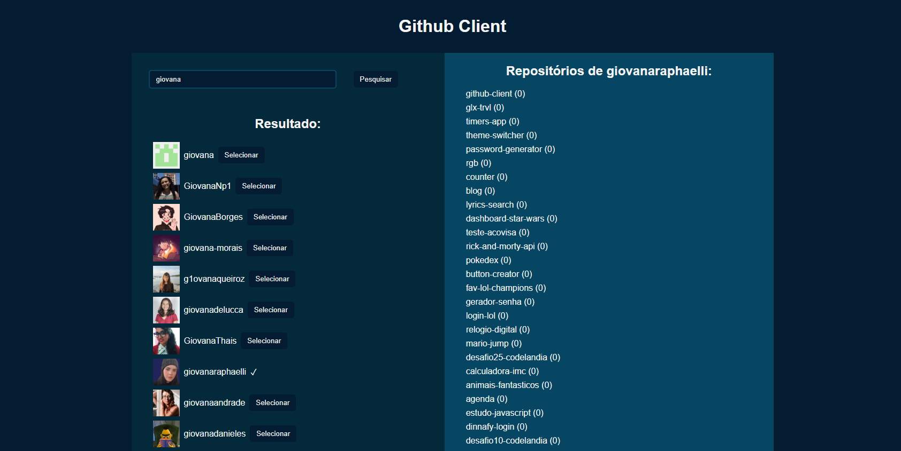

# Github Client

#### Sétimo projeto do curso de React Direto ao Ponto

## 🎯 Objetivo

Este projeto foi desenvolvido em React JS consumindo a API do Github, nela é possível pesquisar repositórios públicos de usuários do Github.

## 🚀 Como executar o projeto

1. Clone este repositório

`$ https://github.com/giovanaraphaelli/github-client.git`

2. Acesse a pasta do projeto no seu terminal/cmd

`$ cd github-client`

3. Abra a pasta do projeto no VS Code via terminal/cmd

`$ code .`

4. Instale as dependências

`$ yarn install`

5. Execute a aplicação em modo de desenvolvimento

`$ yarn start`

6. A aplicação será aberta na porta: 3000 - acesse http://localhost:3000
